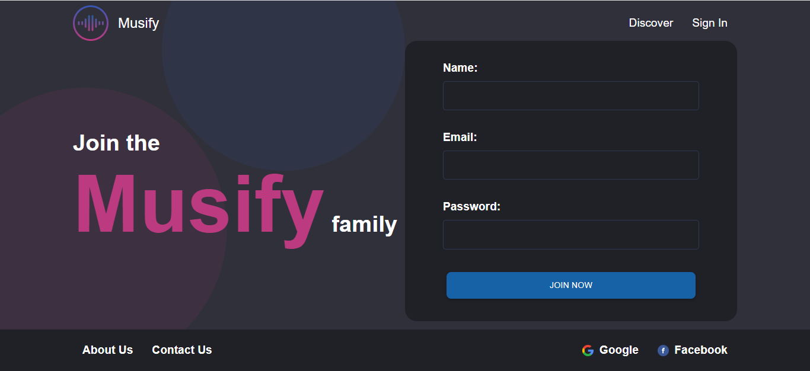
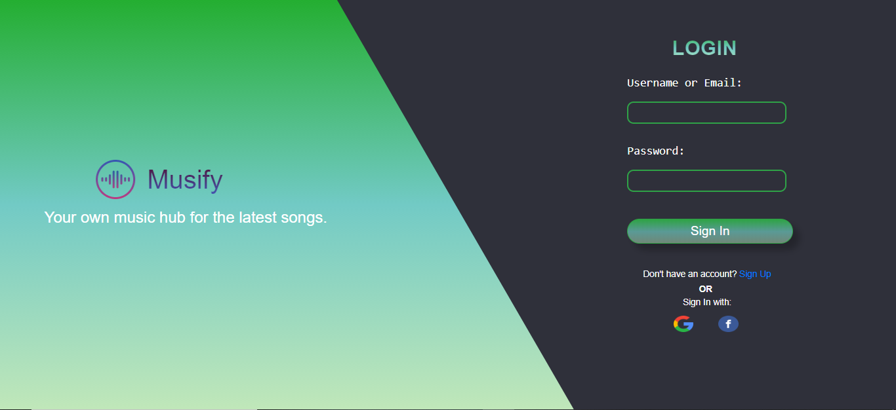
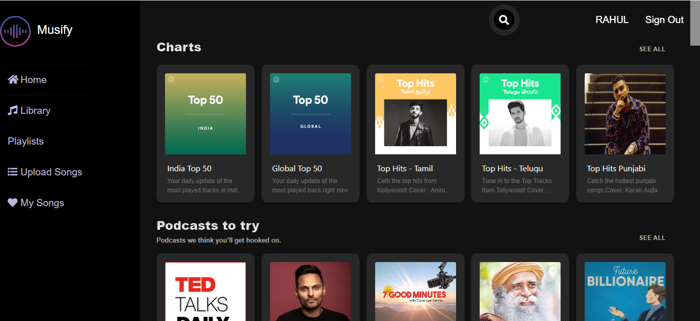
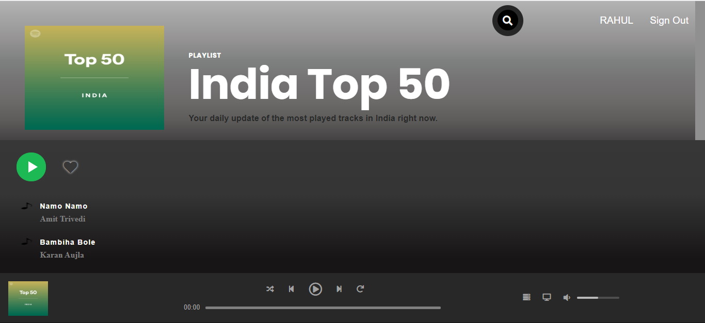
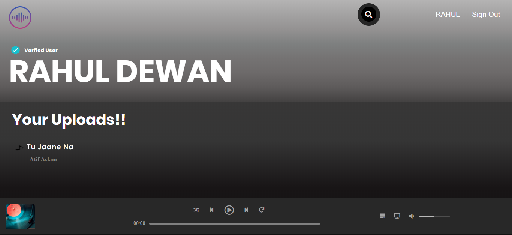

# Musify
 A Music Website made using html, css, bootstrap, js, jquery and mongodb.The site is just like spotify but with some different designs.
   
   ## Requirements  
   "body-parser": "^1.19.0",  
    "connect-mongo": "^3.2.0",  
    "cookie-parser": "^1.4.5",  
    "crypto": "^1.0.1",  
    "ejs": "^3.1.3",  
    "express": "^4.17.1",  
    "express-ejs-layouts": "^2.5.0",  
    "express-session": "^1.17.1",  
    "gridfs-stream": "^1.1.1",  
    "mongodb": "^3.5.9",  
    "mongoose": "^5.9.18",  
    "multer": "^1.4.2",  
    "multer-gridfs-storage": "^4.1.0",  
    "nodemon": "^2.0.4",  
    "passport": "^0.4.1",  
    "passport-google-oauth": "^2.0.0",  
    "passport-local": "^1.0.0",  
    "path": "^0.12.7"  
  
  ## Steps  
  Install all the requirements.  
  Import some of the data in the csv files present in data folder.  
  All the categories are not working only some are accessible.  
  User can also add new categories from the admin route  : /music/admin/upload.  
  User should add his/her google credentials and set the callback url before using google authentication.  
    
   ## Screenshots  
     
     
     
     
     
     
   
  
